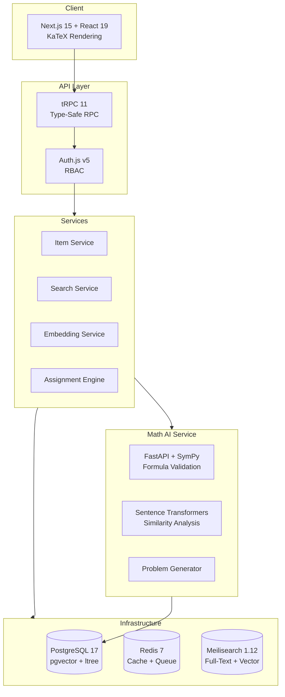

<div align="center">

# Math Item OS

### HWP to HTML Math Question Platform

**HWP(한글) 수학 문서를 웹으로. 추출, 변환, 분석, 추천까지 한 번에.**

[](https://www.typescriptlang.org/)
[](https://nextjs.org/)
[](https://python.org/)
[](LICENSE)
[](CONTRIBUTING.md)

[English](#english) | [한국어](#한국어)

</div>

---

## English

### The Problem

Korean math teachers and educational institutions store thousands of math problems in **HWP (Hangul Word Processor)** files -- a format that is nearly impossible to search, analyze, or reuse on the web. Converting math formulas manually is painful and error-prone.

### The Solution

**Math Item OS** extracts math items from HWP documents, converts them to structured HTML with LaTeX rendering, and provides AI-powered analysis including similarity detection, prerequisite mapping, and personalized assignment recommendations.

```
HWP Document --> Extract & Parse --> Structured HTML + LaTeX --> Knowledge Graph --> Smart Recommendations
```

### Key Features

| Feature | Description |
|---------|-------------|
| **HWP-to-HTML Conversion** | Automatic extraction of math problems with LaTeX formula preservation |
| **Knowledge Graph** | Map relationships between concepts, prerequisites, and skills |
| **AI Similarity Search** | Find similar problems using vector embeddings and semantic analysis |
| **Auto-Generation** | Generate new variants of existing problems using SymPy |
| **Quality Workflow** | Multi-stage review pipeline: Draft > Review > Approved > Retired |
| **Assignment Engine** | Recommend personalized assignments based on student skill levels |
| **Multi-Tenant** | Organization-level data isolation with role-based access control |

### Architecture



### Quick Start

```bash
git clone https://github.com/cskwork/math-item-os.git
cd math-item-os

# Install dependencies
pnpm install

# Start infrastructure (PostgreSQL, Redis, Meilisearch)
docker compose up -d

# Set up environment
cp .env.example .env

# Run database migrations
pnpm db:migrate

# Start development server
pnpm dev
```

Open [http://localhost:3000](http://localhost:3000)

### Requirements

- Node.js >= 20.0.0 / pnpm 9.15+
- Docker & Docker Compose
- Python 3.11+ (for Math AI service)

### Project Structure

```
apps/web/                 # Next.js 15 full-stack application
  src/app/                # App Router pages (dashboard, search, admin)
  src/server/routers/     # tRPC API routers
  src/server/services/    # Domain services (23 services)
packages/
  db/                     # Prisma 6 schema + PostgreSQL client
  math-parser/            # LaTeX formula parsing & KaTeX rendering
  shared/                 # Shared types, validators (Zod), constants
services/
  math-ai/                # Python FastAPI + SymPy microservice
docs/                     # Architecture, ERD, development guides
```

### Tech Stack

| Layer | Technology |
|-------|-----------|
| **Frontend** | Next.js 15, React 19, Tailwind CSS v4, KaTeX 0.16 |
| **API** | tRPC 11, Zod validation |
| **Auth** | Auth.js v5, RBAC (Admin / Reviewer / Teacher) |
| **Database** | PostgreSQL 17 (pgvector, pg_trgm, ltree) |
| **ORM** | Prisma 6 |
| **Search** | Meilisearch 1.12 (full-text + vector) |
| **Queue** | BullMQ + Redis 7 |
| **AI/Math** | FastAPI, SymPy 1.13, Sentence Transformers |
| **Build** | Turborepo, pnpm workspaces |
| **Test** | Vitest (unit), Playwright (E2E) |

### Commands

| Command | Description |
|---------|-------------|
| `pnpm dev` | Start development server |
| `pnpm build` | Production build |
| `pnpm test` | Run tests |
| `pnpm lint` | Lint check |
| `pnpm db:migrate` | Run database migrations |
| `pnpm db:studio` | Open Prisma Studio |

### Contributing

Contributions are welcome! Please see [CONTRIBUTING.md](CONTRIBUTING.md) for guidelines.

1. Fork the repository
2. Create your feature branch (`git checkout -b feat/amazing-feature`)
3. Commit your changes (`git commit -m 'feat: add amazing feature'`)
4. Push to the branch (`git push origin feat/amazing-feature`)
5. Open a Pull Request

### License

This project is licensed under the MIT License - see the [LICENSE](LICENSE) file for details.

---

## 한국어

### 문제

한국의 수학 교사와 교육 기관은 수천 개의 수학 문제를 **HWP(한글) 파일**에 보관합니다. HWP 형식은 웹에서 검색, 분석, 재사용이 거의 불가능하며, 수학 공식을 수동으로 변환하는 작업은 고되고 오류가 잦습니다.

### 해결책

**Math Item OS**는 HWP 문서에서 수학 문항을 추출하고, LaTeX 렌더링이 포함된 구조화된 HTML로 변환합니다. AI 기반 유사 문항 탐색, 선수 학습 매핑, 맞춤형 과제 추천까지 지원합니다.

### 주요 기능

| 기능 | 설명 |
|------|------|
| **HWP-to-HTML 변환** | 수학 문제 자동 추출 및 LaTeX 수식 보존 |
| **지식 그래프** | 개념, 선수 학습, 스킬 간 관계 매핑 |
| **AI 유사 문항 검색** | 벡터 임베딩 + 의미 분석 기반 유사 문항 탐색 |
| **문항 자동 생성** | SymPy 활용 기존 문항의 변형 자동 생성 |
| **품질 관리 워크플로우** | 초안 > 검토 > 승인 > 폐기 다단계 리뷰 |
| **과제 추천 엔진** | 학생 역량 기반 맞춤형 과제 추천 |
| **멀티테넌트** | 조직 단위 데이터 격리 + 역할 기반 접근 제어 |

### 빠른 시작

```bash
git clone https://github.com/cskwork/math-item-os.git
cd math-item-os
pnpm install
docker compose up -d
cp .env.example .env
pnpm db:migrate
pnpm dev
```

[http://localhost:3000](http://localhost:3000) 에서 확인하세요.

### 문서

- [시스템 아키텍처](docs/architecture.md)
- [ERD (엔티티 관계 다이어그램)](docs/erd.md)
- [개발 워크플로우](docs/speckit-workflow.md)

---

<div align="center">

**Math Item OS**는 한국 수학 교육의 디지털 전환을 위한 오픈소스 프로젝트입니다.

Star를 눌러 프로젝트를 응원해주세요!

</div>
