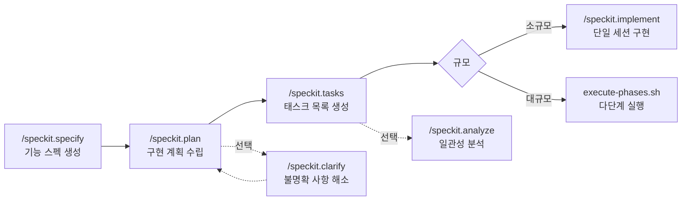

# Speckit 워크플로우 가이드

> Spec-Driven Development (SDD) 프레임워크를 사용한 기능 개발 워크플로우

## 개요

Speckit은 기능 개발을 **스펙 작성 -> 계획 수립 -> 태스크 생성 -> 구현**의 단계로 구조화하는 프레임워크다. `.specify/` 디렉터리에 스크립트, 템플릿, 통합 설정이 위치하며, Claude Code 스킬(`/speckit.*`)로 각 단계를 실행한다.

- 버전: 0.5.1.dev0
- AI 통합: Claude Code
- 브랜치 번호 방식: 순차(sequential)

## 사전 요구사항

| 도구 | 용도 | 필수 여부 |
|------|------|-----------|
| Git | 브랜치 생성/관리 | 필수 |
| Bash 3.2+ | 스크립트 실행 (macOS 기본 포함) | 필수 |
| Claude Code CLI (`claude`) | execute-phases.sh에서 세션 실행 | execute-phases 사용 시 필수 |
| jq | JSON 출력 처리 | 선택 (미설치 시 내장 폴백 사용) |

## 디렉터리 구조

```
.specify/
├── init-options.json              # 초기화 설정 (AI, 브랜치 방식, 버전)
├── integration.json               # 현재 통합 설정
├── memory/
│   └── constitution.md            # 프로젝트 헌법 (품질 원칙/게이트)
├── integrations/
│   ├── claude.manifest.json       # Claude 통합 매니페스트 (SHA256 해시)
│   ├── speckit.manifest.json      # 핵심 스크립트/템플릿 매니페스트
│   └── claude/scripts/
│       └── update-context.sh      # Claude 통합 래퍼 스크립트
├── scripts/bash/
│   ├── common.sh                  # 공유 유틸리티 함수
│   ├── create-new-feature.sh      # 기능 브랜치 + 스펙 디렉터리 생성
│   ├── setup-plan.sh              # plan.md 초기화
│   ├── check-prerequisites.sh     # 전제조건 검증
│   ├── update-agent-context.sh    # AI 에이전트 컨텍스트 파일 업데이트
│   └── execute-phases.sh          # 다단계 태스크 실행
└── templates/
    ├── spec-template.md           # 기능 스펙 템플릿
    ├── plan-template.md           # 구현 계획 템플릿
    ├── tasks-template.md          # 태스크 분해 템플릿
    ├── checklist-template.md      # 리뷰 체크리스트 템플릿
    ├── constitution-template.md   # 프로젝트 헌법 템플릿
    └── agent-file-template.md     # AI 에이전트 컨텍스트 파일 템플릿
```

산출물은 `specs/<브랜치명>/` 하위에 생성된다:

```
specs/002-math-item-os/
├── spec.md          # 기능 스펙
├── plan.md          # 구현 계획
├── tasks.md         # 태스크 목록
├── data-model.md    # 데이터 모델
├── research.md      # 리서치 결과
├── quickstart.md    # 빠른 시작 가이드
├── checklists/      # 리뷰 체크리스트
└── contracts/       # API 계약 스펙
```

## 워크플로우 전체 흐름



각 단계에서 생성되는 파일:

| 단계 | 생성 파일 | 전제조건 |
|------|----------|----------|
| specify | `spec.md`, 브랜치, `specs/<name>/` | 없음 |
| plan | `plan.md`, `research.md`, `data-model.md`, `contracts/` | spec.md |
| tasks | `tasks.md` | plan.md |
| implement / execute | 소스 코드, 테스트 | tasks.md |

---

## 스크립트 레퍼런스

모든 스크립트는 `.specify/scripts/bash/`에 위치한다.

### create-new-feature.sh

기능 브랜치를 생성하고 스펙 디렉터리를 초기화한다.

```bash
bash .specify/scripts/bash/create-new-feature.sh "기능 설명" [옵션]
```

| 옵션 | 설명 |
|------|------|
| `--short-name <name>` | 브랜치명 직접 지정 (2-4 단어) |
| `--number N` | 브랜치 번호 수동 지정 |
| `--timestamp` | 순차 번호 대신 타임스탬프 접두사 사용 |
| `--dry-run` | 브랜치/파일 생성 없이 이름만 미리보기 |
| `--allow-existing-branch` | 이미 존재하는 브랜치면 전환 |
| `--json` | JSON 형식 출력 |

**예시:**

```bash
# 자동 번호 + 이름 생성
bash .specify/scripts/bash/create-new-feature.sh "사용자 인증 시스템 구현"
# -> 003-user-auth-system 브랜치 생성, specs/003-user-auth-system/spec.md 생성

# 이름 직접 지정
bash .specify/scripts/bash/create-new-feature.sh "OAuth2 인증" --short-name oauth2-auth
# -> 003-oauth2-auth

# 미리보기
bash .specify/scripts/bash/create-new-feature.sh "검색 최적화" --dry-run
```

**출력:**

```
BRANCH_NAME: 003-user-auth-system
SPEC_FILE: /path/specs/003-user-auth-system/spec.md
FEATURE_NUM: 003
```

> 브랜치 명명 규칙: `NNN-slug` (순차) 또는 `YYYYMMDD-HHMMSS-slug` (타임스탬프)

---

### setup-plan.sh

피처 디렉터리에 `plan.md`를 템플릿에서 초기화한다. 일반적으로 `/speckit.plan` 스킬이 내부적으로 호출한다.

```bash
bash .specify/scripts/bash/setup-plan.sh [--json]
```

| 옵션 | 설명 |
|------|------|
| `--json` | JSON 형식 출력 |

**출력:**

```
FEATURE_SPEC: /path/specs/002-math-item-os/spec.md
IMPL_PLAN: /path/specs/002-math-item-os/plan.md
SPECS_DIR: /path/specs/002-math-item-os
```

---

### check-prerequisites.sh

구현 전 필수 파일과 디렉터리가 존재하는지 검증한다.

```bash
bash .specify/scripts/bash/check-prerequisites.sh [옵션]
```

| 옵션 | 설명 |
|------|------|
| `--require-tasks` | tasks.md 존재를 필수로 검증 |
| `--include-tasks` | tasks.md를 가용 문서 목록에 포함 |
| `--paths-only` | 검증 없이 경로 변수만 출력 |
| `--json` | JSON 형식 출력 |

**출력 예시:**

```
FEATURE_DIR: /path/specs/002-math-item-os

AVAILABLE_DOCS:
  [check] research.md
  [cross] data-model.md
  [check] contracts/
```

---

### update-agent-context.sh

`plan.md`에서 기술 스택 정보를 파싱하여 AI 에이전트 컨텍스트 파일(CLAUDE.md 등)을 생성/업데이트한다.

```bash
bash .specify/scripts/bash/update-agent-context.sh [에이전트_타입]
```

- 인자 없이 실행: 기존 에이전트 파일 전체 업데이트
- 에이전트 타입 지정: 해당 에이전트 파일만 업데이트

**지원 에이전트** (25+): Claude Code, Gemini, GitHub Copilot, Cursor IDE, Windsurf, Junie, Kilo Code, Roo Code, Qwen Code, Tabnine, Kiro CLI, Mistral Vibe, Trae 등

**동작:**

1. plan.md에서 언어/버전, 의존성, 스토리지, 프로젝트 타입 파싱
2. 언어별 빌드/테스트 명령어 자동 생성
3. 에이전트별 파일 형식에 맞춰 생성 (CLAUDE.md, .cursor/rules/, .windsurf/rules/ 등)
4. 수동 추가 영역(`<!-- MANUAL ADDITIONS START/END -->`) 보존
5. 최근 3개 기능 변경 이력 유지

---

### execute-phases.sh

tasks.md를 읽어 Phase별로 독립된 Claude 세션에서 태스크를 실행한다.

> **주의**: Claude Code 세션 내부에서는 실행할 수 없다. 반드시 별도 터미널에서 실행해야 한다.

```bash
bash .specify/scripts/bash/execute-phases.sh [옵션]
```

| 옵션 | 설명 | 기본값 |
|------|------|--------|
| `--start N` | N번 Phase부터 시작 | 첫 미완료 Phase |
| `--end N` | N번 Phase에서 종료 | 마지막 Phase |
| `--phase N` | N번 Phase만 실행 | - |
| `--max-turns N` | Phase당 최대 에이전트 턴 수 | 200 |
| `--dry-run` | Phase/프롬프트 미리보기 (실행 안 함) | - |
| `--feature-dir D` | 피처 디렉터리 직접 지정 | 자동 감지 |
| `--verbose` | Claude 전체 출력 표시 | - |
| `--model M` | 사용할 모델 지정 | sonnet |

**아키텍처:**

- 각 Phase는 독립된 `claude -p` 세션에서 실행 (컨텍스트 완전 분리)
- Phase 내 각 태스크는 서브에이전트로 디스패치
- 태스크 완료 시 tasks.md에서 `[ ]` -> `[x]`로 자동 업데이트
- 완료된 Phase는 자동 커밋: `feat(phase-N): TXXX - 설명`

**예시:**

```bash
# 전체 Phase 실행
bash .specify/scripts/bash/execute-phases.sh --verbose

# Phase 2만 실행
bash .specify/scripts/bash/execute-phases.sh --phase 2

# 미리보기
bash .specify/scripts/bash/execute-phases.sh --dry-run

# opus 모델로 실행
bash .specify/scripts/bash/execute-phases.sh --model opus --verbose
```

**출력:**

```
=================================================
 Phase-Isolated Task Executor
 Feature : 002-math-item-os
 Tasks   : /path/specs/002-math-item-os/tasks.md
 Turns   : 200 per phase
=================================================

Phase Summary:
  Phase 1: Backend Setup  [2/3]
  Phase 2: API Contracts  [0/2]

--- Phase 1: Backend Setup ---
  Dispatching 1 tasks (max-turns: 200)
  ...

=================================================
 Execution Summary
 Phases executed : 2
 Status          : All successful
=================================================
```

---

### common.sh

다른 스크립트에서 공유하는 유틸리티 함수 모음. 직접 실행하지 않고 `source`로 로드한다.

| 함수 | 용도 |
|------|------|
| `find_specify_root` | `.specify/` 디렉터리 위치 탐색 |
| `get_repo_root` | 저장소 루트 경로 반환 |
| `get_current_branch` | 현재 Git 브랜치명 반환 |
| `get_feature_paths` | 피처 관련 경로 일괄 반환 (spec, plan, tasks 등) |
| `check_feature_branch` | 브랜치 명명 규칙 검증 |
| `find_feature_dir_by_prefix` | 번호 접두사로 피처 디렉터리 탐색 |
| `resolve_template` | 템플릿 우선순위 해석 (overrides > presets > extensions > core) |
| `json_escape` | JSON 문자열 이스케이프 (RFC 8259) |

---

## Claude Code 스킬

Claude Code에서 `/speckit.*` 명령어로 각 단계를 실행할 수 있다.

| 명령어 | 설명 | 사용 시점 |
|--------|------|----------|
| `/speckit.specify` | 기능 브랜치 생성 + spec.md 작성 | 새 기능 시작 시 |
| `/speckit.clarify` | 스펙 내 불명확 사항 질문/해소 | specify 후, plan 전 (선택) |
| `/speckit.plan` | 구현 계획 생성 (plan.md + 부속 문서) | spec 완성 후 |
| `/speckit.tasks` | Phase별 태스크 목록 생성 (tasks.md) | plan 완성 후 |
| `/speckit.analyze` | 산출물 간 일관성 분석 (읽기 전용) | tasks 생성 후, 구현 전 (선택) |
| `/speckit.implement` | 단일 세션에서 태스크 구현 | 소규모 기능 |
| `/speckit.execute` | execute-phases.sh 사용 안내 | 대규모 기능 |
| `/speckit.checklist` | 리뷰 체크리스트 생성 | 품질 검증 시 |
| `/speckit.constitution` | 프로젝트 헌법 생성/수정 | 프로젝트 원칙 정의 시 |
| `/speckit.taskstoissues` | tasks.md를 GitHub 이슈로 변환 | 이슈 트래킹 연동 시 |

---

## 템플릿

`.specify/templates/`에 6개의 마크다운 템플릿이 있다. 스크립트와 스킬이 자동으로 사용한다.

| 템플릿 | 용도 |
|--------|------|
| `spec-template.md` | 기능 스펙 (엘리베이터 피치, 비즈니스 맥락, 성공 지표, 기술 범위) |
| `plan-template.md` | 구현 계획 (아키텍처, 데이터 흐름, 마일스톤, 롤백 계획) |
| `tasks-template.md` | Phase별 태스크 분해 (`[ ]` 체크박스, `[P]` 병렬 마커) |
| `checklist-template.md` | 코드 품질, 테스트, 보안, 배포 체크리스트 |
| `constitution-template.md` | 프로젝트 원칙, 품질 게이트, 개정 절차 |
| `agent-file-template.md` | AI 에이전트 컨텍스트 (기술 스택, 명령어, 코드 스타일) |

**커스터마이징**: `.specify/templates/overrides/`에 동일 이름의 파일을 두면 기본 템플릿 대신 사용된다.

템플릿 해석 우선순위: `overrides/` > `presets/*/templates/` > `extensions/*/templates/` > `templates/`

---

## 실전 예제: 기능 개발 전체 과정

"CAS 검증 엔진 구현" 기능을 예로 든다.

### 1단계: 스펙 생성

```
/speckit.specify CAS(Computer Algebra System) 기반 수학 문항 정답 검증 엔진
```

결과:
- `003-cas-verification` 브랜치 생성
- `specs/003-cas-verification/spec.md` 생성 및 작성

### 2단계: 구현 계획

```
/speckit.plan
```

결과:
- `specs/003-cas-verification/plan.md` 생성
- `specs/003-cas-verification/research.md` 생성
- `specs/003-cas-verification/data-model.md` 생성
- `specs/003-cas-verification/contracts/` API 계약 생성

### 3단계: 태스크 생성

```
/speckit.tasks
```

결과 (`tasks.md`):
```markdown
## Phase 1: Backend Setup
- [ ] T001 - SymPy 서비스 기본 구조 설정
- [ ] T002 - CAS 검증 API 엔드포인트 생성

## Phase 2: Core Engine
- [ ] T003 - LaTeX -> SymPy AST 변환기
- [ ] T004 - 동치성 검증 로직 [P]
- [ ] T005 - 타임아웃 처리 (10초) [P]
```

### 4단계: 구현

소규모 기능이면:
```
/speckit.implement
```

대규모 기능이면 (별도 터미널에서):
```bash
bash .specify/scripts/bash/execute-phases.sh --verbose
```

### 5단계: 에이전트 컨텍스트 업데이트

```bash
bash .specify/scripts/bash/update-agent-context.sh
```

CLAUDE.md 등 에이전트 파일에 새 기능의 기술 스택이 반영된다.

---

## 문제 해결

**"Not on a feature branch" 오류**
- 브랜치명이 `NNN-slug` 또는 `YYYYMMDD-HHMMSS-slug` 형식인지 확인
- `main`, `master`, `develop` 등의 브랜치에서는 실행 불가

**"plan.md not found" 오류**
- 워크플로우 순서 준수: specify -> plan -> tasks -> implement
- `specs/<브랜치명>/plan.md` 파일 존재 여부 확인

**execute-phases.sh가 실행되지 않음**
- Claude Code 세션 내부에서는 실행 불가 (중첩 방지)
- 별도 터미널 창에서 실행해야 함
- `claude` CLI가 PATH에 있는지 확인: `which claude`

**JSON 출력이 깨짐**
- jq 설치 확인: `which jq`
- jq 미설치 시 내장 `json_escape` 폴백이 동작하지만, 복잡한 출력에서는 jq 설치 권장
